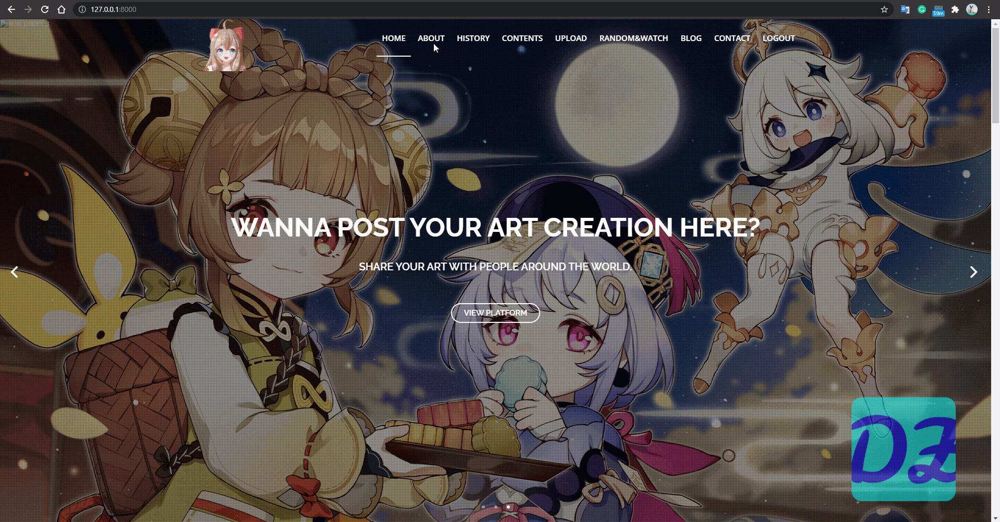

# One Stop Fan Art Aggregator Website

## Overview:
There are so many excellent groups or games in the entertainment market nowadays. For example, Genshin Impact is a popular with all-platform players around the world. Because of that,  fans are willing to spend time viewing fan creations or watch videos related to the game or group. However, because so many platforms are due to worldwide fan groups, it is hard to view all content at one time. By developing an aggregator website for a specific fan group, users can share and view content only related to the group or game instead of switching between pages. 

There are four main functions of the website: 
  * Visitors can see the history and some knowledge related to the topic. 
  * Users can see the newest content. 
  * Creators can upload their artwork. 
  * Viewers can watch random videos if they are tired of the recommendation system.  

## Landing Page 
The landing page contains lots of information related to Genshin Impact so it is necessary to have a clean landing page and jump-to tags. The landing pages are modified by me based on the template from Template Stock. Open-sourced Javascripts libraries are used in developing.

## Content Listing Page
The content list contains all artwork uploaded by users (due to copyright issues,). It also includes a simple searching functionality so users can locate a specific image by title.  

## Uploading Page (Login required)
User can upload their artwork via the page. The content will be stored within the MySQL database and can be retrieved by the content listing function. 

## Random Content Page
By clicking the random button in the bottom left corner, users can randomly watch videos related to the topic. For Genshin Impact, videos from the official account could be a good example to show.

